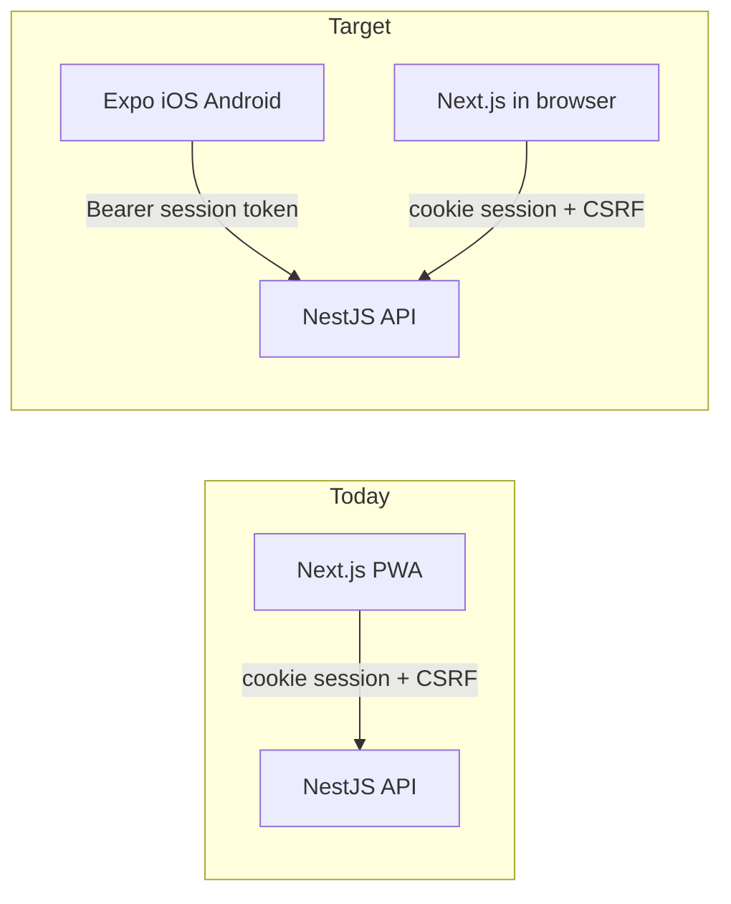

# Sokil PWA → React Native (Expo) migration plan

Status: approved for later implementation. Updated after a codebase review (2026-09); audit findings are woven into the phases and collected in [Codebase audit findings](#codebase-audit-findings-2026-09).

## Current shape (what we are migrating)

Sokil is a pnpm monorepo: Next.js 15 PWA in [apps/web](apps/web) (port 3001) and NestJS 11 in [apps/api](apps/api) (port 3000). The web app is a Next.js shell wrapping React Router ([LangLayoutClient.tsx](apps/web/src/app/[lang]/LangLayoutClient.tsx) + [Content.tsx](apps/web/src/components/Content/Content.tsx)) — not App Router pages per screen. That is actually favorable for Expo Router: most UI already lives in views/ as client screens.

Athlete tab bar (native-like already): trainings, statistics, home, equipment, achievements ([BottomTabBar.tsx](apps/web/src/components/BottomTabBar/BottomTabBar.tsx)).

Auth today: httpOnly session cookie + CSRF cookie/header ([session.service.ts](apps/api/src/auth/session.service.ts), [api.ts](apps/web/src/services/api.ts)). CORS is a single origin (FRONTEND_URL) with credentials: true ([main.ts](apps/api/src/main.ts)). Google OAuth redirects to {FRONTEND_URL}/auth/google/callback then POST /auth/oauth/exchange. JwtAuthGuard is named JWT but uses the cookie session strategy; unused Bearer JWT extraction exists in [jwt.strategy.ts](apps/api/src/auth/strategies/jwt.strategy.ts).

Local-first / offline: localStorage for equipment + trainings ([local-data-storage.ts](apps/web/src/utils/local-data-storage.ts)) with optional sync; public list cache ([offline-cache.ts](apps/web/src/utils/offline-cache.ts)); Serwist SW for PWA.

Web-only pieces that do not port 1:1: MUI + Emotion + SCSS, @serwist/next, canvas image resize/upload, canvas-confetti, Atlaskit DnD (patrols), navigator.share, Next OG/share routes, GA, PWA install prompt.

Shared already: [packages/shared-types](packages/shared-types) (auth, user, tournament, notification, achievements, roles). Domain logic and the 1,260-line [api.ts](apps/web/src/services/api.ts) still live in the web app.

## Browser support (we do not drop it)

Admins (and anyone on a laptop) keep using sokil.app in a normal browser. The migration adds native apps; it does not replace the website with Expo.

Keep: Next.js at [apps/web](apps/web) as a first-class desktop/web client — admin tables, patrol DnD, tournament create/edit, communications, access-control. Cookie session + CSRF stay for this origin.

Sunset: PWA packaging only — Serwist, install prompt, standalone display. The same URLs still work in Chrome/Safari/Firefox on a large screen.

Do not use Expo for Web as the admin UI. Expo web would rebuild MUI tables/DnD poorly and fight the existing Next + React Router app. Native and web stay two UIs on one API.

Athlete-on-web: keep existing athlete screens in Next.js until there is a reason to remove them. Athletes can use the store app on phones; admins stay in the browser. Optional later: hide the “install app” UX and nudge phones toward the store, while desktop stays on web with no nag.

Long-term split:

- Phone: Expo (athlete-first; optional light admin later)
- Desktop browser: Next.js (admin-first; public pages; email/OG links)
- Shared: NestJS + extracted @sokil/api-client / types / i18n

Cost: two clients to maintain. That is intentional so admin does not have to work on a phone.

## Recommended end-state

- Native app: Expo SDK (managed) + Expo Router, iOS + Android, EAS Build / Submit. Package: apps/mobile (@sokil/mobile).
- API: keep NestJS; add a native auth mode (Authorization header) without breaking the browser cookie session.
- Web stays a real app, not a brochure. After PWA sunset it is still the admin and large-screen client, plus:
  - crawler OG pages (/archers/:id, tournament share)
  - password-reset and invitation URLs
  - store badges and Universal Link fallback when the native app is installed
- Do not target Expo web as a Next.js replacement.

Apple App Store rule: if Google Sign-In ships on iOS, Sign in with Apple is required. Plan that in the same auth phase.

## Stack choices (locked)

| Concern    | Choice                                                                                                                                                                                                         |
| ---------- | -------------------------------------------------------------------------------------------------------------------------------------------------------------------------------------------------------------- |
| Runtime    | Expo managed (prebuild only if a library later requires it)                                                                                                                                                    |
| Navigation | Expo Router (file routes mirroring Content.tsx)                                                                                                                                                                |
| UI         | NativeWind or React Native Paper + tokens from [theme/colors.ts](apps/web/src/theme/colors.ts) / Montserrat via expo-font. Do not port MUI.                                                                    |
| Data       | Extract @sokil/api-client from [apps/web/src/services/api.ts](apps/web/src/services/api.ts); AsyncStorage / expo-secure-store instead of cookies/localStorage                                                  |
| i18n       | Keep i18next; move JSON from [apps/web/src/locales](apps/web/src/locales) to packages/i18n (en, uk, de, es, it, pt); language detection via expo-localization on native (browser-languagedetector is web-only) |
| Charts     | victory-native (or similar) for statistics only                                                                                                                                                                |
| Images     | expo-image-picker + expo-image-manipulator (replace canvas uploaders)                                                                                                                                          |
| Share      | expo-sharing / Share API                                                                                                                                                                                       |
| Push       | expo-notifications + API device-token registration (replace 60s poll in [notifications-context.tsx](apps/web/src/contexts/notifications-context.tsx) later)                                                    |
| Offline    | MMKV or AsyncStorage for local-first trainings/equipment; NetInfo for sync                                                                                                                                     |
| e2e mobile | Maestro (lighter, Expo-friendly); Detox only if Maestro proves insufficient. Playwright stays for web.                                                                                                         |

## Phase 0a — Web-only prep (ships independently, before any mobile code)

Deliberately decoupled from Phase 0b so the riskiest web refactor is not on the mobile critical path. Behavior-neutral, verified by the existing Playwright suite.

- Extract `@sokil/api-client` from the 1,260-line [apps/web/src/services/api.ts](apps/web/src/services/api.ts): HTTP layer, CSRF-vs-Bearer adapters, DTO types currently in apps/web/src/services/types.ts. Depends on [packages/shared-types](packages/shared-types).
- Extract `@sokil/i18n` — locale JSON from [apps/web/src/locales](apps/web/src/locales) (en, uk, de, es, it, pt).
- Extract `@sokil/domain` — training/equipment local models + sync helpers, archery calculator, tournament filters, i18n-lang. (Can trail into Phase 1 if it slows 0a.)

Alternative for the first slice only (if 0a stalls): mobile gets a thin copied client for the ~5 endpoints it needs (login, profile); converge into the shared package in Phase 1. Copy-then-converge, do not fork long-term.

## Phase 0b — API native auth + workspace (blocking for all screens)

Auth (blocking): RN cannot use httpOnly cookies + sameSite CSRF the way the PWA does.

- Refactor [SessionService.createSession](apps/api/src/auth/session.service.ts) to return the token and let the controller choose cookie vs body — do not fork the service per client type (it currently writes the cookie via `res` directly).
- Bearer mode: `Authorization: Bearer <sessionToken>`. Presence of the header is the signal — no `X-Client: native` header. On login with Bearer expected, return `{ sessionToken }` in the body.
- Skip CSRF for Bearer-authenticated mutating requests. Clean insertion point already exists: [CsrfGuard](apps/api/src/auth/guards/csrf.guard.ts) + `SkipCsrf` decorator.
- Session TTL: current default is 7 days (`SESSION_TTL_SECONDS`) — wrong for mobile. Introduce a separate native TTL (30–90 days) or sliding renewal. Reuse hashed AuthSession rows; do not invent a second user store.
- “Sign out everywhere” endpoint (revoke all sessions for user) — cheap now, expected on mobile.
- CORS unchanged: keep cookie CORS for FRONTEND_URL; native apps call the API origin directly (no cookie CORS needed).
- Google (primary native flow): system browser (ASWebAuthenticationSession / Custom Tabs) → existing web callback → POST /auth/oauth/exchange (already built: [oauth-exchange.service.ts](apps/api/src/auth/oauth-exchange.service.ts)) → deep link back `sokil://auth/callback?code=...` → app redeems. Do not embed a WebView (Google bans OAuth in embedded webviews; the system-browser flow also avoids per-platform Google client IDs / Android SHA-1 setup).
- Apple: new Nest strategy + expo-apple-authentication.
- CI gate: integration test running the auth-dependent endpoint suite against both cookie and Bearer modes (extend the [session.service.spec.ts](apps/api/src/auth/session.service.spec.ts) pattern). This is how the “every API change must work for both clients” invariant stays true instead of eroding.
- Password reset emails: continue pointing at web URLs that deep-link into the app when installed.

Workspace:

- Wire apps/mobile into pnpm workspace, Biome, typecheck. Expo in a pnpm monorepo needs node-linker / Metro watchFolders for workspace packages.

Deep links: sokil:// + associated domains for sokil.app / archery.fedirko.pro. Map existing paths: /reset-password, /accept-club-invitation/:token, /apply/:tournamentId, /archers/:userId.

Decision needed before Phase 1 (sync semantics): how local-first trainings/equipment reconcile with the server. Proposal: per-record `updatedAt`, last-write-wins, tombstones for deletes. Must be written down before porting [local-data-storage.ts](apps/web/src/utils/local-data-storage.ts).

## Phase 1 — Athlete MVP (store-ready core)

Parity with tab bar + auth:

- Sign in / sign up / reset password / Google (+ Apple)
- Onboarding
- Home dashboard
- Trainings (local-first + sync)
- Equipment (local-first + sync)
- Statistics (charts)
- Achievements
- Profile view/edit, avatar upload (expo-image-manipulator + multipart parity in @sokil/api-client)
- Notifications list (poll first; push in Phase 3)
- Language + dark mode

Store-compliance scope (new):

- In-app account deletion — Apple guideline 5.1.1(v) requires it if the app offers sign-up. No such API endpoint exists today. Decision: build `DELETE /user/me` in Phase 1, or ship v1 without in-app sign-up.
- App-store metadata: privacy policy URL, data-safety declarations (Play) / privacy nutrition labels (Apple), photo + notification permission strings.

Ship TestFlight / Play internal here. Feature-flag anything incomplete.

Exit criteria: cold start < 2 s; login success rate ≥ 99 %; offline training create → sync round-trip test passes; both store tracks distributed to testers.

## Phase 2 — Tournaments and clubs (main PWA value)

From [Content.tsx](apps/web/src/components/Content/Content.tsx):

- Tournament list/detail, public apply, my applications
- Clubs, club detail, my-club, invitations
- Public archer profile + share screens (native share; OG still served by thin web)
- Calculator, converter, glossary, rules (PDF via expo-file-system / Linking)
- Patrols: replace Atlaskit DnD with React Native gesture lists

## Phase 3 — Native platform + ops

- Push notifications — a backend workstream, not a swap. No SSE/websockets exist today; web polls every 60 s. Scope: ExpoPushToken entity + registration endpoint, FCM service account + APNs key management, delivery hooks on notification/announcement creation, unread badge counts.
- Universal Links / App Links QA — includes hosting `apple-app-site-association` and `assetlinks.json` (not yet in place), and a test matrix over all mapped deep-link paths.
- EAS Update (OTA) for JS; keep native binary for permission/SDK bumps.
- Analytics: Expo-compatible GA/Firebase; gate like NEXT_PUBLIC_SITE_MODE.
- Payments screen is demo-only today ([MyPayments](apps/web/src/views/MyPayments/index.tsx)) — skip until a real API exists.

## Phase 4 — Admin stays on web (default)

Default: do not port admin to React Native. Federation/club admins keep the current Next.js UI in a desktop browser:

- Admin users, access-control, communications/announcements
- Tournament create/edit, applications, feedback admin, patrols (Atlaskit DnD stays on web)
- Reference data: categories, divisions, clubs CRUD

Optional later: a few read-only or approval admin actions on phone if operators ask. Dense CRUD and DnD stay on web.

## Phase 5 — PWA sunset (website remains)

When athlete native flows are in stores and stable:

- Remove Serwist, /~offline, install UI ([usePwaInstall.ts](apps/web/src/hooks/usePwaInstall.ts), [AppStatusBar](apps/web/src/components/AppStatusBar/AppStatusBar.tsx))
- Manifest: display: browser (or drop installability); keep start_url for Universal Link fallback
- On narrow/mobile viewports, a “Get the Sokil app” banner is fine; do not block or nag desktop admin sessions
- Keep Playwright coverage for admin and remaining web athlete flows
- Do not delete admin views/ as part of sunset. Only remove athlete web screens if product decides native is the only athlete client (not required)

Local PWA/localStorage trainings still do not auto-migrate to native; signed-in sync remains the bridge for athletes who switch devices.

## API compatibility policy (starts when stores do)

Mobile binaries cannot be force-updated; EAS Update ships JS only, so old native clients live for months:

- After Phase 1 store release, API changes are additive-only, or explicitly versioned.
- Breaking changes require a compat window or min-app-version negotiation.
- The Phase 0b dual-auth CI gate also guards this: web (cookie) and old binaries (Bearer) must both stay green.

## What not to copy

- Service worker / Serwist / beforeinstallprompt
- `credentials: 'include'` as the only auth
- MUI layout primitives, SCSS, window/document/localStorage (wrap in platform adapters)
- Next app/og and metadata as RN screens — keep on web
- Playwright as the only e2e — add Maestro for mobile; keep Playwright for remaining web

## Risks

- Cookie auth is incompatible with RN; Phase 0b is mandatory.
- iOS Google without Apple Sign-In will fail review; in-app sign-up without account deletion will too (5.1.1(v)).
- pnpm + Expo Metro is a common setup tax; budget time.
- Admin DnD + dense tables belong on a large browser window; RN is a poor fit — keep Next.js.
- Share OG requires a live HTTPS page; crawlers never hit Expo.
- Dual clients are long-term (native athletes + web admins): every API change must work for cookie and Bearer. Extracted @sokil/api-client is how we avoid two divergent HTTP stacks; the CI gate is how we keep it true.
- Store binaries outlive API changes: without the compat policy, an API deploy can break shipped apps silently.
- Undefined sync semantics would corrupt athlete training data — the Phase 0b decision is blocking.

## Codebase audit findings (2026-09)

Verified facts this plan builds on:

- Session: opaque token, hashed into AuthSession rows with revoke support ([session.service.ts](apps/api/src/auth/session.service.ts)); TTL default 7 days via `SESSION_TTL_SECONDS`.
- CSRF is a separate guard ([csrf.guard.ts](apps/api/src/auth/guards/csrf.guard.ts)) with a `SkipCsrf` decorator — clean hook for Bearer skip.
- `oauth-exchange.service.ts` + `POST /auth/oauth/exchange` already exist — the native system-browser flow can reuse them as-is.
- Unused Bearer JWT extraction in [jwt.strategy.ts](apps/api/src/auth/strategies/jwt.strategy.ts) — Bearer mode slots in next to it.
- [api.ts](apps/web/src/services/api.ts) is 1,260 lines; DTO types are a single file ([types.ts](apps/web/src/services/types.ts)), not a directory.
- No SSE/websockets anywhere; notifications poll every 60 s ([notifications-context.tsx](apps/web/src/contexts/notifications-context.tsx)); [AppUpdatePrompt](apps/web/src/components/AppUpdatePrompt/AppUpdatePrompt.tsx) polls too (EAS Update replaces it on mobile).
- No account-deletion endpoint exists (user module) — required for Apple 5.1.1(v) if sign-up ships in-app.
- [theme/colors.ts](apps/web/src/theme/colors.ts) holds the token source referenced by the UI row; locales live in [apps/web/src/locales](apps/web/src/locales) (6 languages confirmed).
- MyPayments is demo-only; skip payments entirely.

## Suggested first implementation slice (when execution starts)

Not the whole migration. Two parallel tracks:

1. Track A (web-only): Phase 0a api-client extraction, shipped and verified independently.
2. Track B (integration proof): scaffold apps/mobile, Bearer session on API (0b core), login + profile fetch, Expo Router tabs stub.

Track B proves the hardest integration before rewriting dozens of views; Track A removes the extraction from its critical path.
